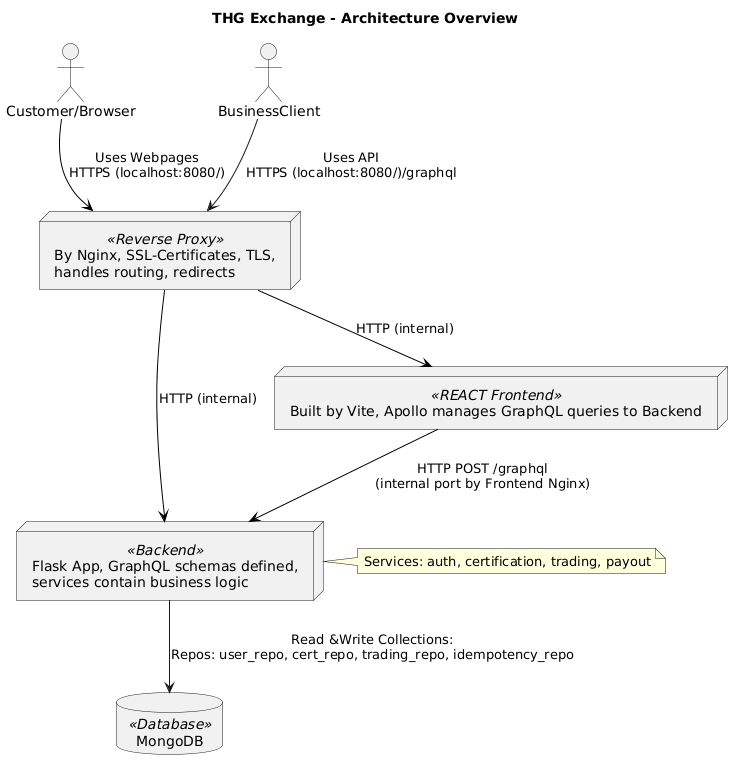

# Digitale Oekonomie Projekt Assignment 3

# How To Run
1. Docker installieren und starten
3. create venv
4. Möglichen Fehler unten beachten
5. docker compose up --build
-> Erstellt backend, frontend, mongo und reverseproxy (nginx) container und lässt sie laufen
6. Die Webapp ist unter https://localhost:8080/ verfügbar. GraphQL queries unter https://localhost:8080/graphql
Source trusten, da certificate self-signed ist (SSL Zertifikate liegen auch im repo).

## Mögliche Fehler
Falls $'\r' command not found:
./entrypoint.sh muss on Windows von IDE als bash Befehl erkannt werden können
VSCode: Die Datei `entrypoint.sh` auswählen und in der Statusleiste unten rechts neben UTF8 von CRLF auf LF stellen und die Datei so speichern. Wir wissen auch nicht warum, aber nur so wird sie ausgeführt, um einen default Admin user zu erzeugen.

# Architecture Overview

- Nginx:
    - Exposed port https://localhost:8080 mit SSL. Routet Aufrufe dann weiter mit http zum Frontend Container
    - Exposed unter https://localhost:8080/graphql die GraphQL Schnittstelle, die im Backend Container definiert ist (wieder http für interne Kommunikation)
    - Dockerfile:
        - nginx:alpine Image
        - TLS: Zertifikate befinden sich in nginx/ssl/ (self-signed). In Produktion sollten echte Zertifikate verwendet werden.
        - Der Reverseproxy nutzt TLS und leitet / und /graphql weiter.
- Frontend:
    - Zunächst lief unser Frontend über Flask-Templates und Flask-Routes. Schlussendlich haben wir uns doch für ein React-Frontend entschieden.
    - In frontend/src/main.jsx wird React initialisiert, sowie der Apollo Client definiert, der in React die Queries/Mutations mit dem Authentication Token an /graphql schickt. 
    vite als build- und dev-tool
    - Vite: dient als Development-Server und als Build-Tool
    - frontend/src/pages beinhaltet JavaScript/React code der dynamischen Webpages
    - frontend/src/components beinhaltet einige wichtige Funktionien zur Authentifizierung, Permission-Zuweisung zu Rollen sowie das default layout der webpages
    - Dockerfile:
        - Multi‑Stage Build: node wird buildstufe mit frontend/dist; nginx:alpine als Production‑Image verwendet.
        - Port 3000 wird intern exposed
 
- MongoDB:
    - Datenbank: MongoDB läuft im Container mongo und ist über MONGO_URI (z.B. mongodb://mongo:27017/thg_exchange_db) konfiguriert
    - Dockerfile:
        - Wir nutzen das offizielle mongo Image
        - Daten werden im Docker‑Volume gespeichert.
- Backend:
    - Hier haben wir uns für eine Flask-App entschieden, da diese weniger Overhead-Arbeit benötigt als andere Frameworks wie z.B. Django.
    - __init.py__ initialisiert die Flask-App
    - thg_exchange/webapp.py definiert die App sowie die GraphQL Schnittstelle. Dazu wird zunächst der JWT-Token überprüft, um dann das schema (Query oder Mutation) auszuführen und die Antwort zurückzugeben. Dabei wird auch die user_id und rolle weitergegeben.
    - In thg_exchange/repositories sind die Datenbankabfragen. Diese haben wir mit der PyMongo library realisiert.
    - Unter thg_exchange/services liegt die Business Logik. Hier geschehen Datenvergleiche, -zuorndungen, sowie auch Input Validation. Sie verwenden dafür die DB-Funktionen in thg_exchange/repositories auf.
    - Dockerfile:
        - Base: python:3.12-slim
        - Installiert die requirements
        - Entrypoint ist entrypoint.sh, wartet auf Mongo, erstellt default Admin und startet Flask.
- docker-compose.yaml:
    - Enthält die Services: backend, frontend, mongo, reverseproxy
    - Volumes mongo_data persistiert DB-Daten

# Admin
- Beim Starten des Docker Containers wird automatisch ein Admin Nutzer mit dem Namen **Admin User** erstellt.
  - Email: `admin@example.com`
  - Passwort: `Admin123!`
- Mit diesem Nutzer können alle verfügbaren Funktionen ausgeführt werden.
- Beim Starten des Docker Containers wird automatisch der Admin Nutzer 'Admin User' erzeugt
    - Email: admin@example.com
    - Passwort: Admin123!
- Falls dieser nicht vorhanden ist, bitte mögliche Fehler s.o. beachten

# Postman Collection für B2B Schnittstelle - How To

Die Verwendung der Postman Collection zur Abbildung der B2B Prozesse ist in README_POSTMAN.md vollständig dokumentiert.

# B2C Use Cases - How To

## Allgemeine Hinweise
- Zugriff über https://localhost:8080 sobald alle Container laufen.
- Es empfiehlt sich, in zwei Session mit einmal einem Customer und einmal dem Admin anzumelden, da einige Funktionen durch den Admin simuliert werden.
- Leider konnten wir nicht vollständig umsetzen, dass alle Seiten nach Aktionen automatisch aktualisiert werden. Daher ist es teilweise notwendig, den Reload Button zu verwenden, um den aktuellen Stand der Seite zu sehen.
- Beim Starten des Docker Containers wird automatisch ein Admin Nutzer mit dem Namen **Admin User** erstellt.
  - Email: `admin@example.com`
  - Passwort: `Admin123!`
- Mit diesem Nutzer können alle verfügbaren Funktionen ausgeführt werden. Falls dieser nicht vorhanden ist, bitte mögliche Fehler s.o. beachten

---

## UC1 Registrierung und Verifikation eines Nutzers
1. Erstellen Sie einen neuen Nutzer über den **Register** Reiter. Anschließend melden Sie sich mit diesem Nutzer im **Login** Reiter an.
2. Die Email Verifikation ist derzeit noch nicht vollständig implementiert. Es wird keine echte Email versendet. Stattdessen wird die Verifikation simuliert, indem Sie sich mit dem Admin Nutzer anmelden und im Reiter **Admin** beim entsprechenden Nutzer den Status von `EMAIL_PENDING` auf `VERIFIED` setzen.  
   Das Setzen des Status auf `KYC_SUBMITTED` ist in diesem Fall nicht sinnvoll, da auch das KYC durch den Admin simuliert wird.
3. Melden Sie sich anschließend erneut mit dem erstellten Nutzer an. Nun kann der Nutzer alle Funktionen verwenden.

---

## UC3 Request erstellen und bestätigen
1. Wechseln Sie in den Reiter **Request** und legen Sie dort einen neuen Request an.
2. Nachdem der Request erfolgreich erstellt wurde, muss sich erneut mit dem Admin Nutzer angemeldet werden, um den Request zu bestätigen oder Rückfragen zu stellen.  
   Wird beispielsweise der Status `NEEDS_MORE_INFORMATION` gewählt, kann der Nutzer seinen Antrag überarbeiten und erneut einreichen.
3. Sobald der Request bestätigt wurde, wird ein Certificate erzeugt, welches im nächsten Use Case gehandelt werden kann.

---

## UC4 Handel von Certificates
1. Im Reiter **Certificates** kann eine neue Sell Order erstellt werden. Zusätzlich zeigt der Reiter **Market Overview** alle aktuell offenen Kauf- und Verkaufsaufträge an, sodass die eigene Order entsprechend angepasst werden kann.
2. Nach dem Erstellen der Order wird geprüft, ob ein passendes Gegenangebot existiert.  
   - Ist ein Gegenangebot vorhanden, wird der Kauf direkt durchgeführt.  
   - Andernfalls wird eine offene Order erstellt und das Certificate wird reserviert.
3. Offene Orders können bearbeitet oder gelöscht werden. Wird eine offene Order gelöscht, ist das Certificate wieder frei handelbar.

---

## UC6 Auszahlung aus der Wallet
1. Im letzten B2C Use Case kann das Guthaben aus der Wallet ausgezahlt werden.
2. Dies erfolgt über den Reiter **Home**. Zunächst muss eine Bankverbindung hinterlegt werden.
3. Nach erfolgreicher Hinterlegung genügt ein Klick auf **Withdraw balance**, um das Guthaben auszuzahlen.

